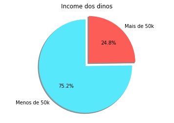

# hackton-questao03
Desafio de inteligencia artificial com objetivo de prever se um cliente é apto a receber empréstimo, a partir de dataset de cadastro de cliente. Foi utilizado as bibliotecas Keras, Sklearn e Mathplot.


```python
import pandas as pd
import numpy as np
import matplotlib.pyplot as plt
```


```python
# Import do data set
df_dino = pd.read_csv("datasets/dinos.csv")
```


```python
# vizualizando cabeçario do dataset
df_dino.head(1)
```


<div>
<style scoped>
    .dataframe tbody tr th:only-of-type {
        vertical-align: middle;
    }

    .dataframe tbody tr th {
        vertical-align: top;
    }

    .dataframe thead th {
        text-align: right;
    }
</style>
<table border="1" class="dataframe">
  <thead>
    <tr style="text-align: right;">
      <th></th>
      <th>age</th>
      <th>workclass</th>
      <th>education_level</th>
      <th>education-num</th>
      <th>marital-status</th>
      <th>occupation</th>
      <th>relationship</th>
      <th>race</th>
      <th>sex</th>
      <th>capital-gain</th>
      <th>capital-loss</th>
      <th>hours-per-week</th>
      <th>native-country</th>
      <th>income</th>
    </tr>
  </thead>
  <tbody>
    <tr>
      <th>0</th>
      <td>39</td>
      <td>State-gov</td>
      <td>Bachelors</td>
      <td>13.0</td>
      <td>Never-married</td>
      <td>Adm-clerical</td>
      <td>Not-in-family</td>
      <td>White</td>
      <td>Male</td>
      <td>2174.0</td>
      <td>0.0</td>
      <td>40.0</td>
      <td>Faerûn</td>
      <td>&lt;=50K</td>
    </tr>
  </tbody>
</table>
</div>


```python
#  Vizualizando por centagem de pessoas que possuem income maior que 50k, este será o parametro para ser ou não um
# cliente de risco.

val_counts = df_dino.income.value_counts()

sizes = [val_counts[0], val_counts[1]]
colors = ['#57e8fc', '#fc5e57']
labels = ['Menos de 50k', 'Mais de 50k']


fig, ax = plt.subplots()
ax.pie(sizes, labels=labels, shadow=True, startangle=90, explode=(0.1,0), autopct='%1.1f%%', colors=colors)
plt.title('Income dos dinos')
ax.axis('equal')
plt.show()
```





```python
# Fazendo transformação de dados literais para numéricos

df_acounts = pd.read_csv("datasets/acounts_dinos.csv")
df_dino = pd.read_csv("datasets/dinos.csv")

df_dino['sex'] = df_dino['sex'].map({' Female':0, ' Male':1}).astype(int)
df_dino['marital-status'] = df_dino['marital-status'].map({
    ' Married-civ-spouse':0,
    ' Never-married':1,
    ' Divorced':2,
    ' Separated':3,
    ' Widowed':4,
    ' Married-spouse-absent':5,
    ' Married-AF-spouse':6 }).astype(int)

df_dino['workclass'] = df_dino['workclass'].map({
    ' Private':0,
    ' Self-emp-not-inc':1,
    ' Local-gov':2,
    ' State-gov':3,
    ' Self-emp-inc':4,
    ' Federal-gov':5,
    ' Without-pay':6
    }).astype(int)

df_dino['education_level'] = df_dino['education_level'].map({
    ' HS-grad': 0,
    ' Some-college': 1,
    ' Bachelors': 2,
    ' Masters': 3,
    ' Assoc-voc': 4,
    ' 11th' : 5,
    ' Assoc-acdm' : 6,
    ' 10th' : 7,
    ' 7th-8th' : 8,
    ' Prof-school':9,
    ' 9th':10,
    ' 12th':11,
    ' Doctorate':12,
    ' 5th-6th' :13,
    ' 1st-4th':14,
    ' Preschool':15    
}).astype(int)

df_dino['occupation'] = df_dino['occupation'].map({
    ' Craft-repair':0,
    ' Prof-specialty':1,
    ' Exec-managerial':2,
    ' Adm-clerical':3,
    ' Sales':4,                
    ' Other-service':5,
    ' Machine-op-inspct':6,
    ' Transport-moving':7,
    ' Handlers-cleaners':8,
    ' Farming-fishing' :9,
    ' Tech-support':10,
    ' Protective-serv':11,
    ' Priv-house-serv':12,
    ' Armed-Forces': 13    
}).astype(int)

df_dino['race'] = df_dino['race'].map({
   ' White':0,
    ' Black':1,
    ' Asian-Pac-Islander': 2,
    ' Amer-Indian-Eskimo':3,
    ' Other':4
}).astype(int)

df_dino['income'] = df_dino['income'].map({
    '<=50K' : 0,
    '>50K' :1
})
```


```python
# Criando nova feature de capital por hora, uma vez que
# coluna capital gain == ganho de capital
# coluna capital loss == perca de capital
# coluna hours per week = horas de trabalho por semana
df_dino['capital_per_hour'] = (df_dino['capital-gain'] - df_dino['capital-loss']) / df_dino['hours-per-week']
```


```python
df_features = df_dino[['age', 'workclass',
                       'education_level',
                       'education-num',
                       'marital-status', 'occupation', 'race', 'sex', 'capital_per_hour']]

df_label = df_dino[['income']]
```


```python
from sklearn.preprocessing import MinMaxScaler


# Faz escalonamento dos valores
scaler = MinMaxScaler(feature_range=(0, 1))
x_scaled_set = scaler.fit_transform(df_features)
y_scaled_set = scaler.fit_transform(df_label)
```


```python
from sklearn.model_selection import train_test_split


X_train, X_test, y_train, y_test = train_test_split( x_scaled_set, y_scaled_set, test_size=0.33)

```


```python
# Criando MLP
from keras.models import Sequential
from keras.layers import Dense, Activation, Dropout


model = Sequential()
model.add(Dense(64, input_dim=9, activation='relu'))
model.add(Dropout(0.5))
model.add(Dense(64, activation='relu'))
model.add(Dropout(0.5))
model.add(Dense(1, activation='sigmoid'))

model.compile(optimizer='rmsprop',
              loss='binary_crossentropy',
              metrics=['accuracy'])
```

    Using TensorFlow backend.


```python


```


```python
# Treinando modelo
model.fit(X_train, y_train, epochs=100)
```

    Epoch 1/100
    30298/30298 [==============================] - 1s 28us/step - loss: 0.4694 - acc: 0.7786
    Epoch 2/100
    30298/30298 [==============================] - 1s 22us/step - loss: 0.4204 - acc: 0.8068
    Epoch 3/100
    30298/30298 [==============================] - 1s 21us/step - loss: 0.4125 - acc: 0.8139
    Epoch 4/100
    30298/30298 [==============================] - 1s 21us/step - loss: 0.4098 - acc: 0.8146: 0s - loss: 0.4125 - acc:
    Epoch 5/100
    30298/30298 [==============================] - 1s 21us/step - loss: 0.4055 - acc: 0.8152
    Epoch 6/100
    30298/30298 [==============================] - 1s 21us/step - loss: 0.4029 - acc: 0.8189
    Epoch 7/100
    30298/30298 [==============================] - 1s 21us/step - loss: 0.3993 - acc: 0.8188
    Epoch 8/100
    30298/30298 [==============================] - 1s 21us/step - loss: 0.3992 - acc: 0.8202
    Epoch 9/100
    30298/30298 [==============================] - 1s 21us/step - loss: 0.3991 - acc: 0.8186
    Epoch 10/100
    30298/30298 [==============================] - 1s 21us/step - loss: 0.3996 - acc: 0.8185
    Epoch 11/100
    30298/30298 [==============================] - 1s 24us/step - loss: 0.3983 - acc: 0.8186
    Epoch 12/100
    30298/30298 [==============================] - 1s 23us/step - loss: 0.3969 - acc: 0.8183
    Epoch 13/100
    30298/30298 [==============================] - 1s 22us/step - loss: 0.3968 - acc: 0.8217
    Epoch 14/100
    30298/30298 [==============================] - 1s 22us/step - loss: 0.3974 - acc: 0.8197
    Epoch 15/100
    30298/30298 [==============================] - 1s 22us/step - loss: 0.3946 - acc: 0.8197
    Epoch 16/100
    30298/30298 [==============================] - 1s 22us/step - loss: 0.3956 - acc: 0.8205
    Epoch 17/100
    30298/30298 [==============================] - 1s 22us/step - loss: 0.3948 - acc: 0.8201
    Epoch 18/100
    30298/30298 [==============================] - 1s 22us/step - loss: 0.3958 - acc: 0.8212
    Epoch 19/100
    30298/30298 [==============================] - 1s 21us/step - loss: 0.3959 - acc: 0.8207
    Epoch 20/100
    30298/30298 [==============================] - 1s 21us/step - loss: 0.3962 - acc: 0.8187
    Epoch 21/100
    30298/30298 [==============================] - 1s 21us/step - loss: 0.3940 - acc: 0.8202
    Epoch 22/100
    30298/30298 [==============================] - 1s 21us/step - loss: 0.3942 - acc: 0.8212
    Epoch 23/100
    30298/30298 [==============================] - 1s 22us/step - loss: 0.3918 - acc: 0.8228
    Epoch 24/100
    30298/30298 [==============================] - 1s 22us/step - loss: 0.3929 - acc: 0.8205
    Epoch 25/100
    30298/30298 [==============================] - 1s 21us/step - loss: 0.3933 - acc: 0.8217
    Epoch 26/100
    30298/30298 [==============================] - 1s 26us/step - loss: 0.3946 - acc: 0.8213
    Epoch 27/100
    30298/30298 [==============================] - 1s 25us/step - loss: 0.3914 - acc: 0.8220
    Epoch 28/100
    30298/30298 [==============================] - 1s 22us/step - loss: 0.3938 - acc: 0.8245
    Epoch 29/100
    30298/30298 [==============================] - 1s 22us/step - loss: 0.3936 - acc: 0.8216
    Epoch 30/100
    30298/30298 [==============================] - 1s 22us/step - loss: 0.3930 - acc: 0.8231
    Epoch 31/100
    30298/30298 [==============================] - 1s 25us/step - loss: 0.3932 - acc: 0.8240
    Epoch 32/100
    30298/30298 [==============================] - 1s 27us/step - loss: 0.3914 - acc: 0.8224
    Epoch 33/100
    30298/30298 [==============================] - 1s 27us/step - loss: 0.3947 - acc: 0.8223
    Epoch 34/100
    30298/30298 [==============================] - 1s 27us/step - loss: 0.3923 - acc: 0.8229
    Epoch 35/100
    30298/30298 [==============================] - 1s 27us/step - loss: 0.3923 - acc: 0.8234
    Epoch 36/100
    30298/30298 [==============================] - 1s 27us/step - loss: 0.3936 - acc: 0.8208
    Epoch 37/100
    30298/30298 [==============================] - 1s 27us/step - loss: 0.3926 - acc: 0.8229
    Epoch 38/100
    30298/30298 [==============================] - 1s 26us/step - loss: 0.3925 - acc: 0.8238
    Epoch 39/100
    30298/30298 [==============================] - 1s 27us/step - loss: 0.3929 - acc: 0.8247
    Epoch 40/100
    30298/30298 [==============================] - 1s 25us/step - loss: 0.3931 - acc: 0.8245
    Epoch 41/100
    30298/30298 [==============================] - 1s 24us/step - loss: 0.3931 - acc: 0.8214
    Epoch 42/100
    30298/30298 [==============================] - 1s 22us/step - loss: 0.3924 - acc: 0.8237
    Epoch 43/100
    30298/30298 [==============================] - 1s 24us/step - loss: 0.3938 - acc: 0.8234
    Epoch 44/100
    30298/30298 [==============================] - 1s 24us/step - loss: 0.3933 - acc: 0.8242
    Epoch 45/100
    30298/30298 [==============================] - 1s 25us/step - loss: 0.3932 - acc: 0.8239
    Epoch 46/100
    30298/30298 [==============================] - 1s 25us/step - loss: 0.3916 - acc: 0.8228
    Epoch 47/100
    30298/30298 [==============================] - 1s 25us/step - loss: 0.3924 - acc: 0.8226
    Epoch 48/100
    30298/30298 [==============================] - 1s 25us/step - loss: 0.3935 - acc: 0.8231
    Epoch 49/100
    30298/30298 [==============================] - 1s 22us/step - loss: 0.3940 - acc: 0.8236
    Epoch 50/100
    30298/30298 [==============================] - 1s 21us/step - loss: 0.3936 - acc: 0.8236
    Epoch 51/100
    30298/30298 [==============================] - 1s 21us/step - loss: 0.3929 - acc: 0.8221
    Epoch 52/100
    30298/30298 [==============================] - 1s 21us/step - loss: 0.3950 - acc: 0.8242
    Epoch 53/100
    30298/30298 [==============================] - 1s 22us/step - loss: 0.3928 - acc: 0.8227
    Epoch 54/100
    30298/30298 [==============================] - 1s 21us/step - loss: 0.3930 - acc: 0.8227
    Epoch 55/100
    30298/30298 [==============================] - 1s 21us/step - loss: 0.3945 - acc: 0.8219
    Epoch 56/100
    30298/30298 [==============================] - 1s 24us/step - loss: 0.3952 - acc: 0.8244
    Epoch 57/100
    30298/30298 [==============================] - 1s 25us/step - loss: 0.3938 - acc: 0.8232
    Epoch 58/100
    30298/30298 [==============================] - 1s 26us/step - loss: 0.3920 - acc: 0.8248
    Epoch 59/100
    30298/30298 [==============================] - 1s 26us/step - loss: 0.3944 - acc: 0.8247
    Epoch 60/100
    30298/30298 [==============================] - 1s 27us/step - loss: 0.3926 - acc: 0.8228
    Epoch 61/100
    30298/30298 [==============================] - 1s 26us/step - loss: 0.3954 - acc: 0.8235
    Epoch 62/100
    30298/30298 [==============================] - 1s 27us/step - loss: 0.3947 - acc: 0.8239
    Epoch 63/100
    30298/30298 [==============================] - 1s 27us/step - loss: 0.3921 - acc: 0.8246
    Epoch 64/100
    30298/30298 [==============================] - 1s 27us/step - loss: 0.3925 - acc: 0.8242
    Epoch 65/100
    30298/30298 [==============================] - 1s 27us/step - loss: 0.3952 - acc: 0.8240
    Epoch 66/100
    30298/30298 [==============================] - 1s 29us/step - loss: 0.3936 - acc: 0.8246
    Epoch 67/100
    30298/30298 [==============================] - 1s 26us/step - loss: 0.3943 - acc: 0.8247
    Epoch 68/100
    30298/30298 [==============================] - 1s 24us/step - loss: 0.3935 - acc: 0.8240
    Epoch 69/100
    30298/30298 [==============================] - 1s 24us/step - loss: 0.3953 - acc: 0.8237
    Epoch 70/100
    30298/30298 [==============================] - 1s 23us/step - loss: 0.3934 - acc: 0.8239
    Epoch 71/100
    30298/30298 [==============================] - 1s 25us/step - loss: 0.3921 - acc: 0.8257
    Epoch 72/100
    30298/30298 [==============================] - 1s 25us/step - loss: 0.3950 - acc: 0.8232
    Epoch 73/100
    30298/30298 [==============================] - 1s 25us/step - loss: 0.3935 - acc: 0.8226
    Epoch 74/100
    30298/30298 [==============================] - 1s 24us/step - loss: 0.3936 - acc: 0.8228
    Epoch 75/100
    30298/30298 [==============================] - 1s 24us/step - loss: 0.3947 - acc: 0.8229
    Epoch 76/100
    30298/30298 [==============================] - 1s 24us/step - loss: 0.3930 - acc: 0.8243
    Epoch 77/100
    30298/30298 [==============================] - 1s 24us/step - loss: 0.3934 - acc: 0.8249
    Epoch 78/100
    30298/30298 [==============================] - 1s 24us/step - loss: 0.3933 - acc: 0.8242
    Epoch 79/100
    30298/30298 [==============================] - 1s 22us/step - loss: 0.3926 - acc: 0.8258
    Epoch 80/100
    30298/30298 [==============================] - 1s 25us/step - loss: 0.3942 - acc: 0.8239
    Epoch 81/100
    30298/30298 [==============================] - 1s 27us/step - loss: 0.3938 - acc: 0.8258
    Epoch 82/100
    30298/30298 [==============================] - 1s 27us/step - loss: 0.3906 - acc: 0.8250
    Epoch 83/100
    30298/30298 [==============================] - 1s 28us/step - loss: 0.3934 - acc: 0.8234
    Epoch 84/100
    30298/30298 [==============================] - 1s 29us/step - loss: 0.3954 - acc: 0.8229
    Epoch 85/100
    30298/30298 [==============================] - 1s 30us/step - loss: 0.3929 - acc: 0.8250
    Epoch 86/100
    30298/30298 [==============================] - 1s 30us/step - loss: 0.3928 - acc: 0.8230
    Epoch 87/100
    30298/30298 [==============================] - 1s 28us/step - loss: 0.3928 - acc: 0.8262
    Epoch 88/100
    30298/30298 [==============================] - 1s 27us/step - loss: 0.3937 - acc: 0.8267
    Epoch 89/100
    30298/30298 [==============================] - 1s 27us/step - loss: 0.3948 - acc: 0.8243
    Epoch 90/100
    30298/30298 [==============================] - 1s 28us/step - loss: 0.3947 - acc: 0.8254
    Epoch 91/100
    30298/30298 [==============================] - 1s 29us/step - loss: 0.3936 - acc: 0.8244
    Epoch 92/100
    30298/30298 [==============================] - 1s 23us/step - loss: 0.3920 - acc: 0.8256
    Epoch 93/100
    30298/30298 [==============================] - 1s 26us/step - loss: 0.3941 - acc: 0.8254
    Epoch 94/100
    30298/30298 [==============================] - 1s 25us/step - loss: 0.3927 - acc: 0.8260
    Epoch 95/100
    30298/30298 [==============================] - 1s 26us/step - loss: 0.3936 - acc: 0.8276
    Epoch 96/100
    30298/30298 [==============================] - 1s 25us/step - loss: 0.3936 - acc: 0.8250
    Epoch 97/100
    30298/30298 [==============================] - 1s 26us/step - loss: 0.3941 - acc: 0.8241
    Epoch 98/100
    30298/30298 [==============================] - 1s 27us/step - loss: 0.3979 - acc: 0.8242
    Epoch 99/100
    30298/30298 [==============================] - 1s 28us/step - loss: 0.3935 - acc: 0.8252
    Epoch 100/100
    30298/30298 [==============================] - 1s 27us/step - loss: 0.3941 - acc: 0.8238


    <keras.callbacks.History at 0x7f61166932e8>


```python
# Testando modelo
score = model.evaluate(X_test, y_test)

print("Loss :",score[0], " Taxa de acerto:", score[1] )
```

    14924/14924 [==============================] - 0s 11us/step
    Loss : 0.36573632593865496  Taxa de acerto: 0.8371080139213067
